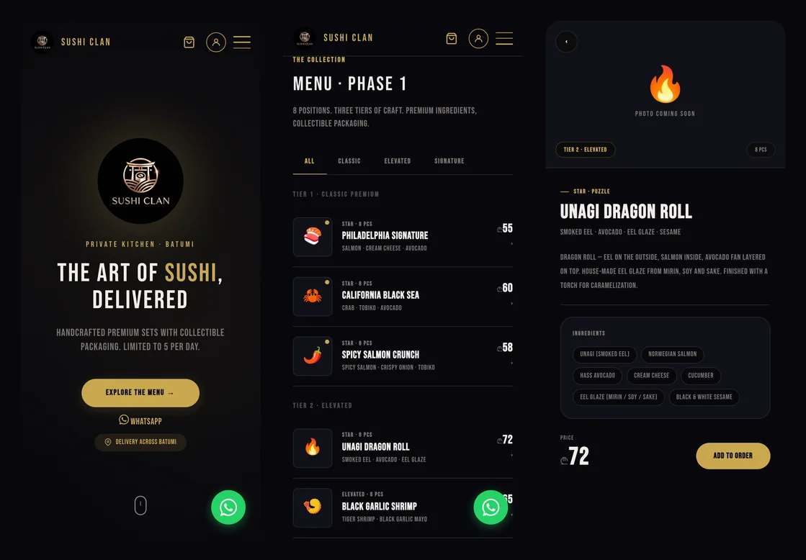
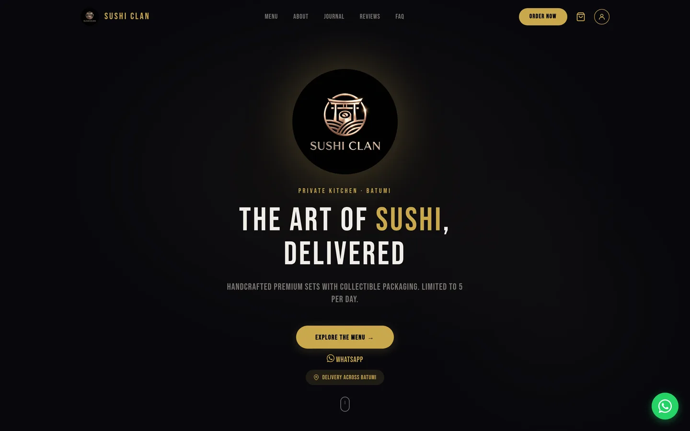
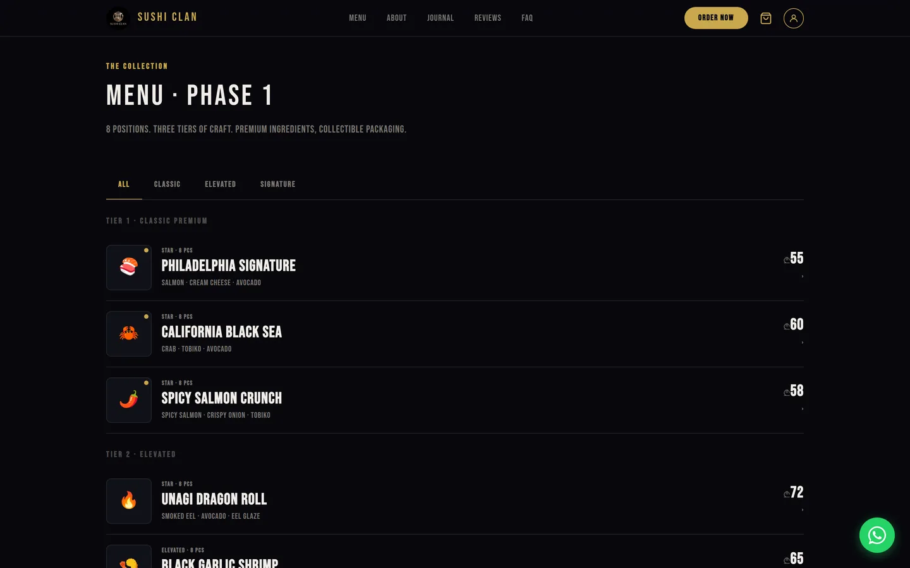
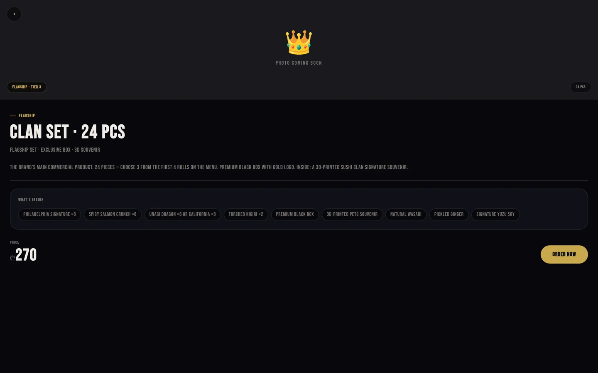
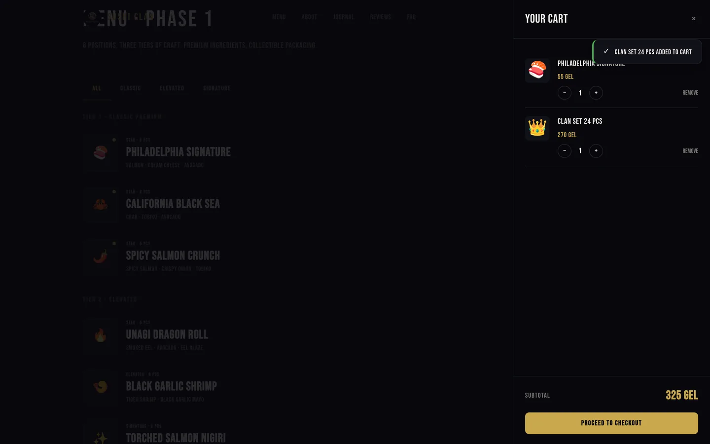
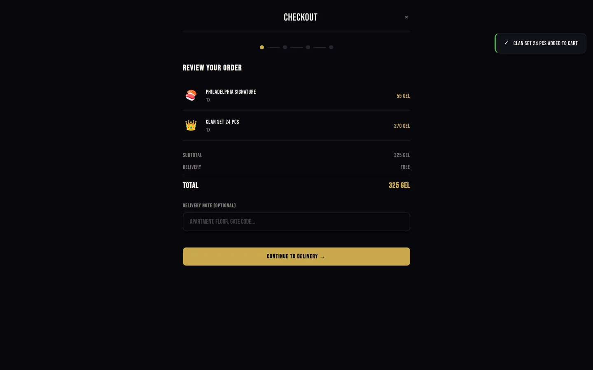
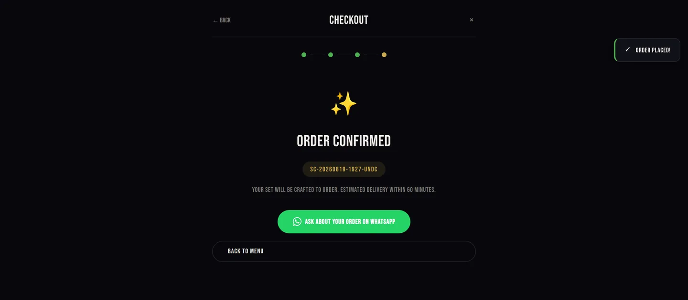
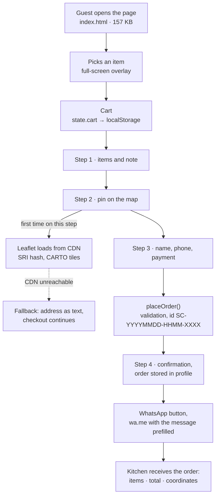

<h1 align="center">SUSHI CLAN</h1>

<p align="center">
  Website for a private kitchen in Batumi: menu, cart, checkout with a map pin,<br>
  and a finished order handed to the kitchen over WhatsApp.<br>
  <b>One HTML file. No build step, no backend, no CMS.</b>
</p>

<p align="center">
  
  
  
  
  
  
</p>

<p align="center"></p>

<p align="center">
  <a href="docs/decisions.md">Decision log</a> ·
  <a href="docs/architecture.md">Architecture</a> ·
  <a href="docs/performance.md">Measurements</a> ·
  <a href="docs/roadmap.md">Roadmap</a>
</p>

---

## What this repository is

Sushi Clan is a private kitchen in Batumi, Georgia. Five sets a day, delivery across the city, collectible packaging. Orders used to arrive in WhatsApp and Instagram DMs, the contents were clarified message by message, and the address was worked out in the same thread.

The site closes that gap. A guest picks items, drops a pin on the map, leaves a name and a phone number, and the kitchen receives one assembled message: items, total, payment method, coordinates, note. Nothing left to ask.

Technically it is a single `index.html` of 4421 lines holding design tokens, markup and logic. Zero dependencies on the main path; the map loads only when the guest reaches the step that needs it. A first visit costs 174 KB over two requests to our own domain.

I keep this repository as a case study. The code is here, and so is the reasoning behind it: the constraints, the decisions with their price, the measurements, and an honest list of what does not work yet.

---

## How it looks

<table>
<tr>
<td width="50%"></td>
<td width="50%"></td>
</tr>
<tr>
<td></td>
<td></td>
</tr>
<tr>
<td></td>
<td></td>
</tr>
</table>

The design was built phone first. Single-column menu, item cards that open full screen and close with a swipe to the right, tap targets no smaller than 44 pixels, padding that respects the iPhone notch through `env(safe-area-inset-*)`. On desktop the same layout stretches and you can see it: the right side of a menu row sits empty. A deliberate trade, since food gets ordered from phones.

---

## The task and its constraints

The brief was simple: a site where an order ends up in WhatsApp. The constraints around it were the interesting part, and they shaped the architecture.

| Constraint | What follows from it |
|---|---|
| No server, and nobody to maintain one | Static only. Nothing that needs restarting |
| Guests pay the courier in cash or by card, no acquiring | No payment gateway, therefore no backend to support one |
| The kitchen lives in WhatsApp, questions arrive there too | The order has to land in WhatsApp. A new tool would not get opened mid-shift |
| Premium positioning, collectible packaging | No template design. Dark theme, gold, large type |
| Food photos are not shot yet | Placeholders must not look like holes in the layout |
| Zero budget for subscriptions | No paid APIs or SaaS among the dependencies |
| Shared hosting on IIS | Hence `Web.config` in the root |

If I had arrived with Next.js, Strapi and Stripe, the project would have stalled: nobody to update it, nothing to pay with, and five orders a day to justify it. The engineering here was subtraction. What had to remain was exactly the path that carries an order to the kitchen intact.

---

## How an order travels



The last step is where it gets interesting. The site does not send the order itself. It assembles the message and opens WhatsApp with the text already typed. This is what actually reaches the kitchen, captured from the running page rather than written by hand:

```
🍣 NEW ORDER #SC-20260819-1927-UNDC

📦 Order:
1× Philadelphia Signature (55 GEL)
1× Clan Set 24 pcs (270 GEL)

💰 Total: 325 GEL
💳 Payment: cash

👤 Nino G.
📞 +995 555 123 456
🏠 Sherif Khimshiashvili St 15, apt 24
📍 https://www.google.com/maps?q=41.64230,41.63120
```

Coordinates travel as a Google Maps link, so the courier taps once and sees the point instead of decoding "the green building behind the pharmacy". The order id is readable by a human and sortable by a machine: date, time, four random characters.

---

## Decisions and what they cost

| Decision | Why | What it costs |
|---|---|---|
| One HTML file instead of a framework | Updating the site means uploading one file. No build to break, no deploy stage at all | 4421 lines in a single file. Once it grows further it has to be split |
| Zero dependencies on the main path | Nothing to rot, no security alerts to chase | Everything is hand written, including toasts and overlays |
| WhatsApp as the order transport | The kitchen is already there. A new tool would not get opened mid-shift | The order leaves only if the guest taps the button |
| `localStorage` as the only storage | The cart survives a reload without a single line on a server | Another device means an empty cart. The server knows nothing about the order |
| Leaflet and OpenStreetMap instead of Google Maps | No key, no billing account, no third-party map inside the owner's account | The tiles belong to someone else. If they fail, the text fallback takes over |
| The map loads only on step 2 | 46 KB of library is not paid for by people who only browsed the menu | The first entry into that step takes a fraction of a second longer |
| Design tokens in CSS variables | Palette and scale live in one place, no rebuild | Discipline is on me, not on a linter |
| Overlays instead of routing | No reloads, state stays in memory | An item has no URL of its own: not shareable, not indexable |
| Demo login labelled Demo | The profile and order history mechanics are visible, nobody is misled | It demonstrates the mechanics. It is not authentication |
| Escaping everything that reaches `innerHTML` | A review containing `<script>` stays text | Every render goes through `esc()` and it cannot be forgotten |

The long version, with the alternatives I weighed for each, is in [docs/decisions.md](docs/decisions.md).

---

## What I measured

The first version shipped four megabytes per visit. The logo was a 2048×2048 PNG, and the same file was pulled into the header for a 38-pixel icon. The most expensive line in the project.

| | Before | After | Delta |
|---|---|---|---|
| First visit, total | 4093 KB | 174 KB | −96% |
| Logo | 3936 KB, PNG 2048px | 17 KB, WebP 640px | −99.6% |
| Requests to our domain | 2 | 2 | — |
| `index.html` | 156.2 KB, gzip 31.4 | 157.1 KB, gzip 31.8 | +0.9 KB |
| DOM nodes | 750 | 755 | +5 |

What I did: rebuilt the logo at 640 pixels (enough for a 3× display at a 220-pixel render), served WebP through `<picture>` with a PNG fallback, set `width`/`height` so the header stops jumping, and put `fetchpriority="high"` on the LCP element. A byte-identical duplicate, `logo.png.png`, sat next to the original at 3.8 MB; it is gone.

Those 174 KB cover only what this repository serves. Bebas Neue arrives from Google Fonts, which adds around 14 KB and two requests to a third-party domain.

The numbers reproduce: `node tools/measure.js` starts a static server and drives Chromium over it. Method and full output in [docs/performance.md](docs/performance.md).

A side finding from the same runs: when `fonts.googleapis.com` is unreachable, `DOMContentLoaded` waits for the network timeout. In my offline run that was 13 seconds of white screen. The font sits in a render-blocking `<link>`, so the first paint depends on somebody else's domain. Self-hosting the font fixes it, and that is the first item on the roadmap.

---

## What honestly does not work

The list is deliberately detailed. I would rather a reader see the edges of this solution immediately than go hunting for them.

- The order reaches the kitchen only through the WhatsApp button. The "Order Confirmed" screen is a receipt for the guest, not proof of delivery. Close the tab earlier and the kitchen sees nothing. The fix is a webhook and a queue on a server.
- Data lives in the browser. Cart, order history and reviews sit in `localStorage`. Move from phone to laptop and it is empty. A review is visible only to its author.
- Prices come from `data` attributes. They are visible in the source and editable in the console. With cash on delivery this is survivable because the kitchen confirms the total, but there is no server-side price check.
- Login is a stub. The OTP accepts any four digits, the Google button asks nothing. The word Demo appears three times in the interface so the mechanics are not mistaken for the real thing.
- There is no validation between checkout steps. You can pass the map step without pinning anything; only name and phone are required before submitting. That was intentional so broken tiles cannot block an order, but the address check should come back.
- Focus moves into dialogs but is not trapped. It lands on the first control on open and returns to the opener on close. Tab can still walk out into the background. There is no real focus trap.
- The "5 sets a day" limit does not exist in code. It is a brand promise on the page and counts nothing. A counter arrives with the database.
- English only. Menus in Batumi are usually read in three languages.
- Bebas Neue is forced on everything through `!important` in a universal selector. Perfect for headings, questionable for article paragraphs. That was my call and I do not like it: display and body type should be separated.

---

## What comes next

Phase two is where a server appears, and it is already designed: FastAPI or Supabase for orders, n8n for routing (order → kitchen Telegram bot → confirmation to the guest), idempotency keyed by order id, retries and structured logs, stop list and a daily limit counter in the database, payments through a Georgian acquirer. Stage by stage with estimates in [docs/roadmap.md](docs/roadmap.md).

---

## Stack and layout

```
index.html            the whole page: tokens, markup, logic (4421 lines)
logo.webp / logo.png  logo at 640×640, WebP with a PNG fallback
Web.config            IIS hosting
tools/check.py        assets, head tags and weight budget
tools/measure.js      first-visit weight measured through Chromium
.github/workflows/    CI: runs check.py on every push
docs/
  architecture.md     state, flows, accessibility, security
  decisions.md        decision log with context and price
  performance.md      measurement method and numbers
  roadmap.md          phase two
  media/              screenshots
```

Inside `index.html`: CSS variables for palette, type scale and spacing; `clamp()` instead of breakpoints for sizing; `content-visibility: auto` on heavy sections; `IntersectionObserver` for reveal animations that unobserve after the first hit; `prefers-reduced-motion`; a passive scroll listener. The logic sits in a single `App` IIFE with private state and a short public API.

Checks before publishing:

```bash
python3 tools/check.py     # assets exist, weight within budget, head intact
node tools/measure.js      # what a first visit weighs (needs playwright)
```

Running it locally:

```bash
git clone https://github.com/raphsoundmix-ctrl/sushi-clan-site.git
cd sushi-clan-site
python3 -m http.server 8080
```

The file opens straight from the file manager too, but the map and the font behave differently over `file://`, so a server is the better way.

---

## What this case says about me

I work on AI automation: agents, n8n, integrations, generative content. Frontend is part of the same job, because almost every automation needs an interface through which data gets into it.

This project shows how I approach a product task. Business constraints first, technology second. The simplest tool that solves the problem, plus an explanation of why I did not take the complicated one. Measurements over hunches: 4 MB became 174 KB after a measurement, not after a feeling that something was slow. The edges of the solution written down openly, including the parts I dislike myself. And the next step designed early, so moving to a backend is not a rewrite.

**Rafael Kuldashev** · AI Automation Engineer · Tbilisi, Georgia
[raphsoundmix@gmail.com](mailto:raphsoundmix@gmail.com) · WhatsApp +995 598 084 145

The client in the wild: [instagram.com/sushi_clan_premium](https://www.instagram.com/sushi_clan_premium)

---

<sub>The site's code and content belong to Sushi Clan. This repository is public as a portfolio case: read it, take it apart, ask questions. Reusing the brand and the content is not part of the deal.</sub>
