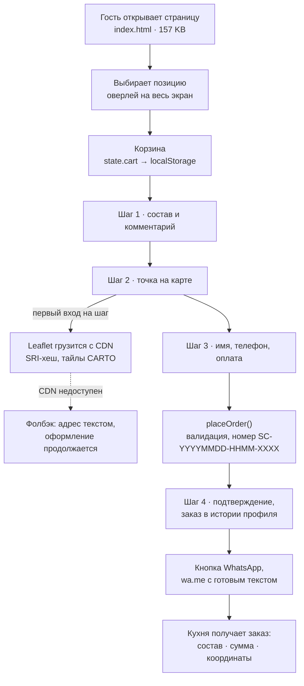

<h1 align="center">SUSHI CLAN</h1>

<p align="center">
  Сайт приватной кухни в Батуми: витрина, корзина, оформление заказа с картой<br>
  и передача готового заказа на кухню в WhatsApp.<br>
  <b>Один HTML-файл. Без сборки, без бэкенда, без CMS.</b>
</p>

<p align="center">
  
  
  
  
  
  
</p>

<p align="center"></p>

<p align="center">
  <a href="README.en.md">English version</a> ·
  <a href="docs/decisions.md">Журнал решений</a> ·
  <a href="docs/architecture.md">Архитектура</a> ·
  <a href="docs/performance.md">Замеры</a> ·
  <a href="docs/roadmap.md">Что дальше</a>
</p>

---

## О чём этот репозиторий

Sushi Clan — приватная кухня в Батуми. Пять сетов в день, доставка по городу, коллекционная упаковка. Заказы приходили в WhatsApp и директ Instagram, состав уточнялся сообщениями, адрес выяснялся там же.

Сайт закрывает ровно этот кусок. Гость выбирает позиции, ставит точку на карте, оставляет имя и телефон, и на кухню уходит собранное сообщение: состав, сумма, способ оплаты, координаты, комментарий. Переспрашивать нечего.

Технически это одна страница `index.html` на 4421 строку: дизайн-токены, разметка и логика в одном файле. Ноль зависимостей в основном сценарии, карта подгружается только когда до неё дошли. Первый визит стоит 174 КБ и два запроса к своему домену.

Репозиторий я держу как разобранный кейс. Здесь лежит код и объяснение, почему он такой: контекст задачи, решения с ценой каждого, замеры и честный список того, что пока не работает.

---

## Как выглядит

<table>
<tr>
<td width="50%"></td>
<td width="50%"></td>
</tr>
<tr>
<td></td>
<td></td>
</tr>
<tr>
<td></td>
<td></td>
</tr>
</table>

Дизайн строился от телефона. Меню в одну колонку, карточка позиции открывается на весь экран и закрывается свайпом вправо, кнопки не меньше 44 пикселей, отступы уважают вырез айфона через `env(safe-area-inset-*)`. На десктопе та же вёрстка растягивается, и это заметно: правая часть строки меню пустует. Осознанный размен, еду заказывают с телефонов.

---

## Задача и её рамки

Задача звучала просто: сайт, с которого заказ попадает в WhatsApp. Интереснее были рамки, в которых он должен жить, — именно они определили архитектуру.

| Рамка | Что из неё следует |
|---|---|
| Нет сервера и нет человека, который будет его чинить | Только статика. Ничего, что нужно перезапускать |
| Платят курьеру наличными или картой, эквайринга нет | Платёжный шлюз не нужен, а значит не нужен и бэкенд под него |
| Кухня живёт в WhatsApp, туда же приходят все вопросы | Заказ должен приезжать в WhatsApp. Новый инструмент кухня в смену не откроет |
| Позиционирование премиум, упаковка коллекционная | Дизайн не шаблонный. Тёмная тема, золото, крупная типографика |
| Фотографий блюд ещё нет, съёмка позже | Плейсхолдеры не должны выглядеть как дырки в вёрстке |
| Бюджет на подписки нулевой | Никаких платных API и SaaS в зависимостях |
| Хостинг обычный шаред на IIS | Отсюда `Web.config` в корне |

Если бы я пришёл сюда с Next.js, Strapi и Stripe, проект бы не поехал: обновлять некому, платить не из чего, а заказов пять в день. Инженерная работа состояла в отрезании лишнего. Остаться должно было ровно то, что доносит заказ до кухни без потерь.

---

## Как работает заказ



Самое интересное происходит на последнем шаге. Сайт не отправляет заказ сам, он собирает сообщение и открывает WhatsApp с уже набранным текстом. Вот что реально приходит на кухню — снято с работающей страницы, а не написано от руки:

```
🍣 NEW ORDER #SC-20260819-1927-UNDC

📦 Order:
1× Philadelphia Signature (55 GEL)
1× Clan Set 24 pcs (270 GEL)

💰 Total: 325 GEL
💳 Payment: cash

👤 Nino G.
📞 +995 555 123 456
🏠 Sherif Khimshiashvili St 15, apt 24
📍 https://www.google.com/maps?q=41.64230,41.63120
```

Координаты уходят ссылкой на Google Maps: курьер жмёт и видит точку, вместо того чтобы расшифровывать «зелёный дом за аптекой». Номер заказа читается человеком и сортируется машиной: дата, время, четыре случайных символа.

Разбор состояния, карты и обработчиков — в [docs/architecture.md](docs/architecture.md).

---

## Решения и их цена

Полная версия с контекстом каждого решения лежит в [docs/decisions.md](docs/decisions.md). Здесь сжато.

| Решение | Почему так | Чем плачу |
|---|---|---|
| Один HTML-файл вместо фреймворка | Обновление сайта это заливка одного файла. Сборке нечего ломать, деплой не существует как этап | Файл на 4421 строку. Разрастётся — придётся резать |
| Ноль зависимостей в основном пути | Нечему протухнуть и нечего обновлять по security-алертам | Всё написано руками, включая тосты и оверлеи |
| WhatsApp как транспорт заказа | Кухня уже там. Новый инструмент никто бы не открыл | Заказ уезжает, только если гость нажал кнопку |
| `localStorage` как единственное хранилище | Корзина переживает перезагрузку без единой строки на сервере | Другое устройство — пустая корзина. Сервер о заказе не знает |
| Leaflet и OpenStreetMap вместо Google Maps | Без ключа, без биллинга, без чужой карты в аккаунте владельца | Тайлы чужие. Упадут — работает текстовый фолбэк |
| Карта грузится только на шаге 2 | 46 КБ библиотеки не платят те, кто просто листал меню | Первое открытие шага занимает лишние доли секунды |
| Дизайн-токены в CSS-переменных | Палитра и шкала правятся в одном месте, без пересборки | Ручная дисциплина вместо утилит Tailwind |
| Оверлеи вместо роутинга | Нет перезагрузок, состояние живёт в памяти | У ролла нет своего URL: не пошарить, не проиндексировать |
| Демо-логин честно подписан словом Demo | Механика профиля и истории заказов показана, никто не обманут | Это витрина механики, а не аутентификация |
| Экранирование всего, что идёт в `innerHTML` | Отзыв со `<script>` внутри останется текстом | Каждый рендер идёт через `esc()`, забыть нельзя |

---

## Что я померил

Первая версия отдавала четыре мегабайта на визит. Логотип лежал в PNG 2048×2048, и он же тянулся в шапку под иконку 38 пикселей. Самая дорогая строчка в проекте.

| | Было | Стало | Разница |
|---|---|---|---|
| Первый визит целиком | 4093 КБ | 174 КБ | −96% |
| Логотип | 3936 КБ, PNG 2048px | 17 КБ, WebP 640px | −99.6% |
| Запросов к своему домену | 2 | 2 | — |
| `index.html` | 156.2 КБ, в gzip 31.4 | 157.1 КБ, в gzip 31.8 | +0.9 КБ |
| Узлов в DOM | 750 | 755 | +5 |

Что сделал: пересобрал логотип в 640 пикселей (запас под 3× ретину при показе в 220), отдал WebP через `<picture>` с PNG-фолбэком, проставил `width`/`height`, чтобы шапка не прыгала, повесил `fetchpriority="high"` на LCP-элемент. Дубликат `logo.png.png` на 3.8 МБ, лежавший рядом с оригиналом, удалил.

В 174 КБ входит только то, что отдаёт этот репозиторий. Шрифт Bebas Neue приезжает с Google Fonts, это ещё около 14 КБ и два запроса к чужому домену.

Цифры воспроизводятся: `node tools/measure.js` поднимает статику и гоняет по ней Chromium. Метод и полный вывод — в [docs/performance.md](docs/performance.md).

Побочная находка из тех же замеров: когда `fonts.googleapis.com` недоступен, `DOMContentLoaded` ждёт сетевого таймаута. В офлайн-прогоне это 13 секунд белого экрана. Шрифт подключён блокирующим `<link>`, и первый рендер зависит от чужого домена. Лечится переносом шрифта к себе, это первый пункт в [роадмапе](docs/roadmap.md).

---

## Что здесь честно не работает

Список специально подробный. Мне важнее, чтобы человек, который открыл код, сразу увидел границы решения, а не искал их сам.

- Заказ доходит до кухни только через кнопку WhatsApp. Экран «Order Confirmed» — это чек для гостя, а не факт доставки заказа. Закроет вкладку раньше — на кухне ничего не появится. Лечится вебхуком и очередью на сервере.
- Данные живут в браузере. Корзина, история заказов и отзывы лежат в `localStorage`. Гость перешёл с телефона на ноутбук — там пусто. Оставленный отзыв видит только он сам.
- Цены приходят из `data`-атрибутов. Их видно в исходнике и можно поправить в консоли. При оплате курьеру это не страшно, сумму подтверждает кухня, но серверной проверки цены здесь нет.
- Логин это заглушка. OTP принимает любые четыре цифры, кнопка Google ничего не запрашивает. В интерфейсе слово Demo стоит в трёх местах, чтобы механику не приняли за настоящую.
- Между шагами оформления нет валидации. Пройти шаг с картой, ничего не поставив, можно, обязательными проверяются только имя и телефон перед отправкой. Так сделано, чтобы неработающие тайлы не блокировали заказ, но проверку адреса стоит вернуть.
- Фокус в модалках переводится, но не запирается. При открытии оверлея он уходит на первый элемент, при закрытии возвращается на кнопку-источник. Табом из диалога всё ещё можно уйти в фон, полноценного focus trap нет.
- Лимит «5 сетов в день» в коде не живёт. Он написан на странице как обещание бренда и ничего не считает. Счётчик появится вместе с базой.
- Интерфейс только на английском. В Батуми меню обычно читают на трёх языках.
- Bebas Neue навязан всему через `!important` в звёздочном селекторе. Для заголовков он отличный, для абзацев в статьях спорный. Это моё решение, и оно мне самому не нравится: дисплейный и текстовый шрифт правильнее развести.

---

## Что дальше

Вторая фаза это та, где появляется сервер, и она уже спроектирована: FastAPI или Supabase под заказы, n8n на маршрутизацию (заказ → Telegram-бот кухни → подтверждение гостю), идемпотентность по номеру заказа, ретраи и структурные логи, стоп-лист и счётчик дневного лимита в базе, оплата через грузинский эквайринг. Разбор по этапам с оценками — в [docs/roadmap.md](docs/roadmap.md).

---

## Стек и структура

```
index.html            вся страница: токены, вёрстка, логика (4421 строка)
logo.webp / logo.png  логотип 640×640, WebP с PNG-фолбэком
Web.config            хостинг на IIS
tools/check.py        проверка ассетов, head-тегов и бюджета веса
tools/measure.js      замер веса первого визита через Chromium
.github/workflows/    CI: гоняет check.py на каждый пуш
docs/
  architecture.md     состояние, потоки, доступность, безопасность
  decisions.md        журнал решений с контекстом и ценой
  performance.md      метод замеров и цифры
  roadmap.md          вторая фаза
  media/              скриншоты
```

Внутри `index.html`: CSS-переменные для палитры, типографской шкалы и отступов; `clamp()` вместо брейкпоинтов на размерах; `content-visibility: auto` на тяжёлых секциях; `IntersectionObserver` для появления блоков с отпиской после первого срабатывания; `prefers-reduced-motion`; пассивный слушатель скролла. Логика собрана в одну IIFE `App` с приватным состоянием и коротким публичным API.

Проверки перед публикацией:

```bash
python3 tools/check.py     # ассеты на месте, вес в бюджете, head не потерян
node tools/measure.js      # сколько весит первый визит (нужен playwright)
```

Запуск локально:

```bash
git clone https://github.com/raphsoundmix-ctrl/sushi-clan-site.git
cd sushi-clan-site
python3 -m http.server 8080
```

Файл открывается и просто из проводника, но по `file://` карта и шрифт ведут себя иначе, так что лучше через сервер.

---

## Что этот кейс показывает обо мне

Я занимаюсь AI-автоматизацией: агенты, n8n, интеграции, генеративный контент. Фронтенд — часть той же работы: почти любой автоматизации нужен интерфейс, через который в неё попадают данные.

Здесь видно, как я подхожу к продуктовой задаче. Сначала выясняю рамки бизнеса, потом выбираю технологии, а не наоборот. Беру самый простой инструмент, который закрывает задачу, и могу объяснить, почему не взял сложный. Меряю, а не предполагаю: 4 МБ превратились в 174 КБ после замера, а не после ощущения «что-то тормозит». Границы решения пишу открыто, включая то, что мне самому в нём не нравится. И проектирую следующий шаг заранее, чтобы переход на бэкенд не превратился в переписывание с нуля.

**Rafael Kuldashev** · AI Automation Engineer · Тбилиси, Грузия
[raphsoundmix@gmail.com](mailto:raphsoundmix@gmail.com) · WhatsApp +995 598 084 145

Сайт клиента в жизни: [instagram.com/sushi_clan_premium](https://www.instagram.com/sushi_clan_premium)

---

<sub>Код и тексты сайта принадлежат Sushi Clan. Репозиторий открыт как портфолио-кейс: смотреть, разбирать и задавать вопросы можно, переиспользовать бренд и контент нельзя.</sub>
