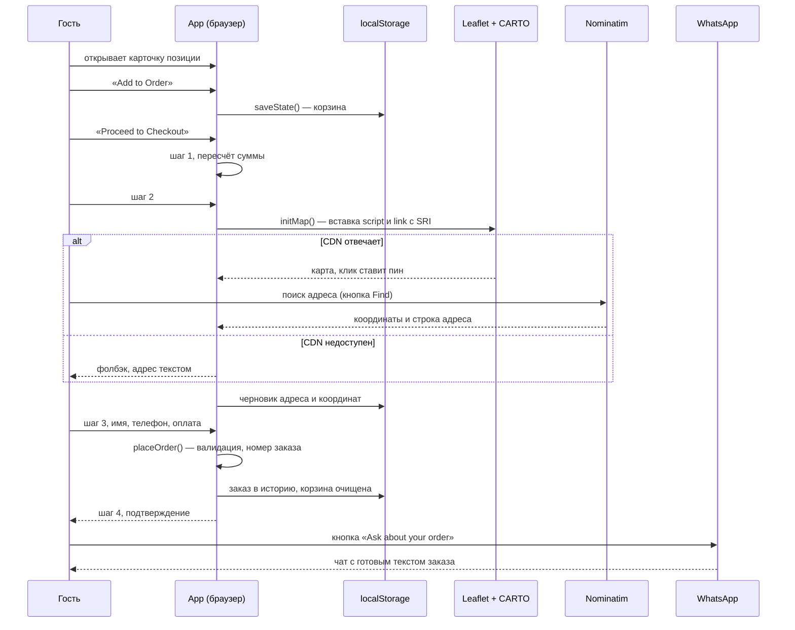

# Архитектура

Как устроена страница внутри: карта файла, состояние, путь заказа, карта доставки, доступность, безопасность и приёмы производительности. Плюс инструкция, как менять контент, если под рукой нет разработчика.

[← назад к обзору](../README.md)

---

## Карта файла

Весь сайт — `index.html`, 4421 строка. Границы блоков:

| Строки | Что там |
|---|---|
| 1–18 | `head`: мета, `theme-color`, `referrer`, `nosniff`, подключение шрифта, `preload` логотипа |
| 19–2373 | `<style>` целиком |
| 20–64 | дизайн-токены в `:root`: палитра, типографская шкала, отступы, радиусы, кривые |
| 66–197 | ресет, база, `prefers-reduced-motion`, `safe-area`, анимации |
| 199–1351 | компоненты страницы: навигация, первый экран, меню, философия, журнал, отзывы, FAQ, футер |
| 1407–2373 | наложения: тосты, корзина, авторизация, оформление, профиль, статья |
| 2375–3412 | разметка |
| 3413–4419 | `<script>`: модуль `App` |

CSS секционирован комментариями-разделителями — по ним удобно прыгать поиском. Порядок в файле повторяет порядок на экране, кроме наложений: они собраны в конце, потому что живут поверх всего.

---

## Модуль App

Вся логика — одна IIFE со `'use strict'`. Наружу торчит десяток методов, всё остальное закрыто замыканием.

```js
const App = (() => {
  'use strict';
  let state = { user: null, cart: [], orders: [], reviews: [], isLoggedIn: false, seeded: false };
  // ...
  return { toggleMobileMenu, openCart, closeCart, updateQty, removeFromCart,
           closeCheckout, resendOtp, openItemDetail, closeItemDetail };
})();
```

Наружу вынесено то, что вызывается из атрибутов `onclick` в динамически собираемой разметке: кнопки количества в корзине, закрытие оверлеев, повтор OTP. Всё остальное живёт на `addEventListener` внутри `init()` — навигация, вкладки меню, шаги оформления, звёзды рейтинга, клавиша Escape.

### Состояние и его сохранение

Единственный источник правды — объект `state`. После каждой мутации он целиком уходит в `localStorage`:

```js
function saveState() {
  try { localStorage.setItem(STORAGE_KEY, JSON.stringify(state)); }
  catch (e) { /* приватный режим Safari — работаем в памяти */ }
}
```

Чтение при старте так же обёрнуто в `try/catch` и мержится поверх дефолтов через спред, поэтому старая сохранённая структура без новых полей не ломает приложение.

Что лежит в `state`:

| Ключ | Содержимое | Когда пишется |
|---|---|---|
| `cart` | позиции с `id`, `name`, `price`, `qty`, `emoji` | при добавлении и изменении количества |
| `orders` | оформленные заказы с составом, контактами, координатами | при `placeOrder()` |
| `reviews` | отзывы, которые оставил этот браузер | при отправке формы |
| `user` | имя, телефон, инициал, месяц регистрации | после демо-входа |
| `checkout` | черновик: адрес и координаты | пока гость заполняет шаг 2 |

Черновик оформления сохраняется отдельно и восстанавливается при повторном открытии: если гость свернул браузер на середине, точка на карте и адрес возвращаются на место.

---

## Путь заказа



### Номер заказа

```js
const orderId = `SC-${now.getFullYear()}${pad(now.getMonth()+1)}${pad(now.getDate())}`
              + `-${pad(now.getHours())}${pad(now.getMinutes())}-${rand}`;
// SC-20260819-1927-UNDC
```

Дата и время читаются человеком и сортируются лексикографически. Четыре символа из `Math.random().toString(36)` разводят заказы, оформленные в одну минуту. Для пяти сетов в день коллизий не бывает; когда номера начнёт выдавать сервер, формат останется тем же, а хвост станет последовательным.

### Что валидируется

Перед оформлением проверяются имя (минимум два символа) и телефон (минимум девять цифр после очистки от всего, кроме цифр, плюса, скобок, пробелов и дефисов). Имя обрезается сотней символов, текст отзыва пятьюстами. Всё остальное необязательно и уезжает как есть.

### Сообщение на кухню

Текст собирается из состава, суммы, способа оплаты, контактов, адреса, координат и комментария, кодируется `encodeURIComponent` и подставляется в `https://wa.me/<номер>?text=...`. Пустые поля не попадают в сообщение: если координат нет, строки с картой просто не будет.

---

## Карта доставки

Три независимых способа поставить точку, потому что каждый по отдельности иногда не срабатывает:

1. Тап по карте — `leafletMap.on('click')` ставит золотой `L.divIcon` с SVG внутри.
2. Кнопка «Use my location» — `navigator.geolocation` с `enableHighAccuracy`, таймаутом 10 секунд и кешем в минуту. Отказ в разрешении не ломает шаг, показывается тост «pin manually».
3. Поиск адреса — Nominatim с принудительным `, Batumi, Georgia` в запросе, ответ ограничен одной записью, найденная строка подставляется в поле адреса.

Любая из трёх дорог заканчивается в `setDeliveryPin(lat, lng)`, которая обновляет маркер, сохраняет координаты в черновик, показывает координаты с точностью до пяти знаков и раскрывает ссылку «Open in Google Maps».

Тайлы CARTO Voyager выбраны светлыми осознанно: сайт тёмный, и светлая карта в нём читается как отдельный рабочий инструмент, а золотой пин на ней видно сразу.

---

## Доступность

Что сделано:

- Клавиша Escape закрывает верхний открытый слой в порядке приоритета: статья, оформление, авторизация, профиль, корзина.
- Фокус при открытии диалога переводится на первый интерактивный элемент, при закрытии возвращается на кнопку, которая его открыла.
- Диалоги размечены `role="dialog"` и `aria-modal="true"`, у контейнера тостов `aria-live="polite"`.
- У всех иконочных кнопок есть `aria-label`, декоративные SVG помечены `aria-hidden`.
- Карточки журнала доступны с клавиатуры: `tabindex="0"`, `role="button"` и обработчик Enter и пробела.
- FAQ собран на нативных `<details>`, то есть работает и без JavaScript.
- `prefers-reduced-motion: reduce` гасит анимации и плавный скролл.
- Блокировка скролла фона сохраняет позицию и возвращает её при закрытии, иначе iOS выбрасывает страницу наверх.

Чего не сделано: полноценного focus trap. Табуляция из открытого диалога уходит на фон. Это записано в долги в [README](../README.md#что-здесь-честно-не-работает).

---

## Безопасность

- Всё, что попадает в `innerHTML`, проходит через `esc()`: замена `& < > " '` на сущности. Числа дополнительно прогоняются через `Number()`, рейтинг зажимается в 0–5.
- Leaflet подключается с `integrity` и `crossorigin`: подменённый файл браузер не выполнит.
- В `head` заданы `referrer: strict-origin-when-cross-origin` и `X-Content-Type-Options: nosniff`.
- Внешние ссылки, открывающиеся в новой вкладке, идут с `rel="noopener noreferrer"`.
- Ввод чистится перед использованием: телефон от лишних символов, имя и отзыв по длине.

Чего здесь нет и быть не может без сервера: проверки цены, лимита заказов, защиты от накрутки отзывов. Всё это переезжает во вторую фазу.

---

## Производительность

| Приём | Где |
|---|---|
| `content-visibility: auto` | тяжёлые секции ниже первого экрана |
| `IntersectionObserver` с `unobserve` после срабатывания | появление блоков при скролле |
| Пассивный слушатель скролла | смена фона навигации |
| Ленивая загрузка Leaflet | только при первом входе на шаг 2 |
| `clamp()` вместо брейкпоинтов | вся типографская шкала |
| WebP через `<picture>` плюс `width`/`height` | логотип |
| `fetchpriority="high"` и `preload` | логотип первого экрана, он же LCP |

Цифры и метод замера — в [performance.md](performance.md).

---

## Как поменять контент

Всё правится в `index.html`, разработчик для этого не нужен.

**Цена или состав позиции.** Ищите название блюда. Оно встречается дважды: в строке меню (блок `.menu-item`) и в детальном оверлее (`#detail-<id>`). Цена лежит в трёх местах: `.menu-item-price`, `.item-detail-price-val` и атрибут `data-item-price` на кнопке заказа. Атрибут важнее всего — именно из него цена попадает в корзину.

**Новая позиция.** Скопируйте блок `.menu-item` внутрь нужного тира и блок `#detail-<id>` в раздел оверлеев. Свяжите их атрибутом `data-detail`. На кнопке заказа заполните `data-item-id`, `data-item-name`, `data-item-price`, `data-item-emoji`. Обработчики навешиваются автоматически при загрузке, руками ничего дописывать не надо.

**Статья в журнале.** Текст статей лежит в массиве `articles` в скрипте. Добавьте объект с полями `emoji`, `tag`, `title`, `meta`, `content` (массив абзацев) и карточку `.blog-card` с `data-article`, равным индексу в массиве.

**Номер WhatsApp.** Встречается пять раз: первый экран, финальный блок, футер, плавающая кнопка и сборка сообщения в `placeOrder()`. Меняйте поиском по номеру, чтобы не пропустить ни одного.

После правок прогоните `python3 tools/check.py` — он поймает битые ссылки на файлы, пропавшие мета-теги и превышение бюджета веса.

---

[← назад к обзору](../README.md) · [решения](decisions.md) · [замеры](performance.md) · [роадмап](roadmap.md)
