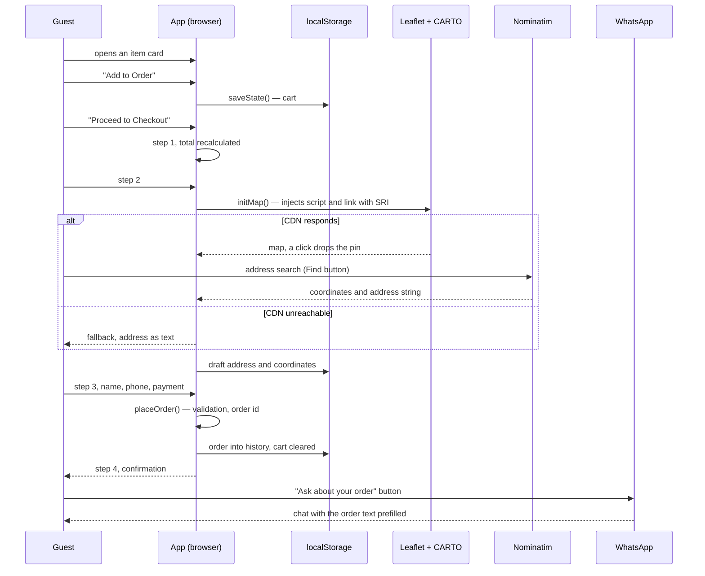

# Architecture

How the page works inside: the file map, state, the order path, the delivery map, accessibility, security and the performance techniques. Plus instructions for changing content when no developer is around.

[← back to the overview](../README.md)

---

## File map

The whole site is `index.html`, 4421 lines. The boundaries:

| Lines | What is there |
|---|---|
| 1–18 | `head`: meta, `theme-color`, `referrer`, `nosniff`, the font link, the logo `preload` |
| 19–2373 | the entire `<style>` |
| 20–64 | design tokens in `:root`: palette, type scale, spacing, radii, easing |
| 66–197 | reset, base, `prefers-reduced-motion`, `safe-area`, animations |
| 199–1351 | page components: navigation, hero, menu, philosophy, journal, reviews, FAQ, footer |
| 1407–2373 | layers: toasts, cart, auth, checkout, profile, article |
| 2375–3412 | markup |
| 3413–4419 | `<script>`: the `App` module |

The CSS is sectioned with divider comments, which makes jumping around by search easy. The order in the file mirrors the order on screen, except for the layers: they sit at the end because they live on top of everything.

---

## The App module

All the logic is one IIFE with `'use strict'`. About ten methods are exposed; everything else stays inside the closure.

```js
const App = (() => {
  'use strict';
  let state = { user: null, cart: [], orders: [], reviews: [], isLoggedIn: false, seeded: false };
  // ...
  return { toggleMobileMenu, openCart, closeCart, updateQty, removeFromCart,
           closeCheckout, resendOtp, openItemDetail, closeItemDetail };
})();
```

What is exposed is what gets called from `onclick` attributes in dynamically built markup: the quantity buttons in the cart, overlay closing, the OTP resend. Everything else lives on `addEventListener` inside `init()` — navigation, menu tabs, checkout steps, rating stars, the Escape key.

### State and how it persists

The single source of truth is the `state` object. After every mutation it goes into `localStorage` whole:

```js
function saveState() {
  try { localStorage.setItem(STORAGE_KEY, JSON.stringify(state)); }
  catch (e) { /* Safari private mode — keep working in memory */ }
}
```

Reading at startup is wrapped the same way and merged over the defaults with a spread, so an older saved shape without newer fields does not break the app.

What lives in `state`:

| Key | Contents | Written when |
|---|---|---|
| `cart` | items with `id`, `name`, `price`, `qty`, `emoji` | on add and on quantity change |
| `orders` | placed orders with items, contacts, coordinates | in `placeOrder()` |
| `reviews` | reviews left from this browser | on form submit |
| `user` | name, phone, initial, sign-up month | after the demo login |
| `checkout` | draft: address and coordinates | while the guest fills in step 2 |

The checkout draft is stored separately and restored when the guest comes back: if they minimised the browser halfway through, the map pin and the address return to where they were.

---

## The order path



### The order id

```js
const orderId = `SC-${now.getFullYear()}${pad(now.getMonth()+1)}${pad(now.getDate())}`
              + `-${pad(now.getHours())}${pad(now.getMinutes())}-${rand}`;
// SC-20260819-1927-UNDC
```

Date and time are readable by a person and sort lexicographically. Four characters from `Math.random().toString(36)` separate orders placed within the same minute. At five sets a day collisions do not happen; when a server starts issuing ids the format stays and the tail becomes sequential.

### What gets validated

Before placing an order, the name (at least two characters) and the phone (at least nine digits after stripping everything but digits, plus, brackets, spaces and dashes) are checked. The name is truncated at 100 characters, review text at 500. Everything else is optional and travels as typed.

### The message to the kitchen

The text is assembled from items, total, payment method, contacts, address, coordinates and the note, encoded with `encodeURIComponent` and dropped into `https://wa.me/<number>?text=...`. Empty fields never make it into the message: with no coordinates, the map line simply is not there.

---

## The delivery map

Three independent ways to drop a pin, because each one occasionally fails on its own:

1. Tapping the map — `leafletMap.on('click')` places a gold `L.divIcon` with inline SVG.
2. The "Use my location" button — `navigator.geolocation` with `enableHighAccuracy`, a 10 second timeout and a one minute cache. A denied permission does not break the step; a toast suggests pinning manually.
3. Address search — Nominatim with a forced `, Batumi, Georgia` in the query, capped at one result, and the found string filled into the address field.

All three roads end in `setDeliveryPin(lat, lng)`, which updates the marker, saves the coordinates into the draft, shows them to five decimal places and reveals the "Open in Google Maps" link.

CARTO Voyager tiles are light on purpose: the site is dark, and a light map inside it reads as a separate working tool, with the gold pin instantly visible on it.

---

## Accessibility

What is in place:

- Escape closes the topmost open layer in priority order: article, checkout, auth, profile, cart.
- Focus moves to the first interactive element when a dialog opens and returns to the button that opened it on close.
- Dialogs carry `role="dialog"` and `aria-modal="true"`; the toast container has `aria-live="polite"`.
- Every icon button has an `aria-label`, decorative SVG is marked `aria-hidden`.
- Journal cards work from the keyboard: `tabindex="0"`, `role="button"` and a handler for Enter and Space.
- The FAQ is built on native `<details>`, so it works with JavaScript disabled.
- `prefers-reduced-motion: reduce` kills animations and smooth scrolling.
- The background scroll lock saves the position and restores it on close, otherwise iOS throws the page to the top.

What is missing: a real focus trap. Tab walks out of an open dialog into the background. It is written down in the debt list in the [README](../README.md#what-honestly-does-not-work).

---

## Security

- Everything that reaches `innerHTML` goes through `esc()`: `& < > " '` become entities. Numbers additionally pass through `Number()`, the rating is clamped to 0–5.
- Leaflet loads with `integrity` and `crossorigin`: a swapped file will not execute.
- `head` sets `referrer: strict-origin-when-cross-origin` and `X-Content-Type-Options: nosniff`.
- External links that open in a new tab carry `rel="noopener noreferrer"`.
- Input is cleaned before use: the phone from stray characters, the name and the review by length.

What is not here and cannot be without a server: price validation, an order limit, protection against review stuffing. All of it moves into phase two.

---

## Performance

| Technique | Where |
|---|---|
| `content-visibility: auto` | heavy sections below the fold |
| `IntersectionObserver` with `unobserve` after the first hit | reveal on scroll |
| Passive scroll listener | navigation background change |
| Lazy Leaflet loading | only on the first entry into step 2 |
| `clamp()` instead of breakpoints | the whole type scale |
| WebP through `<picture>` plus `width`/`height` | the logo |
| `fetchpriority="high"` and `preload` | the hero logo, which is the LCP element |

Numbers and the measurement method are in [performance.md](performance.md).

---

## Changing the content

Everything is edited in `index.html`; no developer needed.

**A price or the contents of an item.** Search for the dish name. It appears twice: in the menu row (`.menu-item`) and in the detail overlay (`#detail-<id>`). The price sits in three places: `.menu-item-price`, `.item-detail-price-val` and the `data-item-price` attribute on the order button. The attribute matters most — that is where the cart takes the price from.

**A new item.** Copy the `.menu-item` block into the right tier and the `#detail-<id>` block into the overlay section. Link them with the `data-detail` attribute. On the order button fill in `data-item-id`, `data-item-name`, `data-item-price`, `data-item-emoji`. Handlers are attached automatically on load, nothing has to be wired by hand.

**A journal article.** Article text lives in the `articles` array in the script. Add an object with `emoji`, `tag`, `title`, `meta` and `content` (an array of paragraphs), plus a `.blog-card` whose `data-article` equals the index in the array.

**The WhatsApp number.** It appears five times: the hero, the final block, the footer, the floating button and the message assembly in `placeOrder()`. Replace it by searching for the number so none is missed.

After editing, run `python3 tools/check.py` — it catches broken file references, missing meta tags and anything over the weight budget.

---

[← back to the overview](../README.md) · [decisions](decisions.md) · [measurements](performance.md) · [roadmap](roadmap.md)
