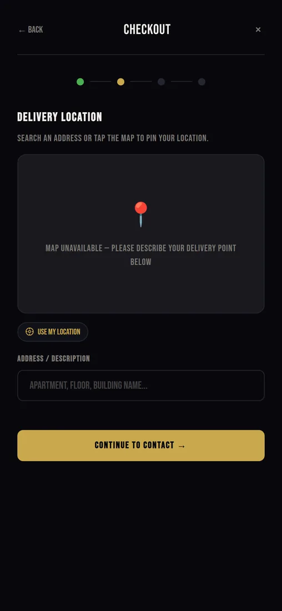

# Decision log

Fifteen decisions this site is built from. For each one: what came in, what I picked, what else I weighed, and what the choice costs. Roughly in the order they were made.

[← back to the overview](../README.md)

---

## 1. One HTML file instead of a framework

The site lives on shared hosting under IIS, and the person who updates it is the kitchen owner, not a developer. Any build step means: install Node, pull dependencies, build, upload `dist`. Six months later `npm install` breaks on some major version bump and the site freezes.

So the whole project is `index.html`: design tokens, markup and logic in one place. Changing a price in the menu takes a minute and needs nothing but a text editor.

What I considered: Astro (produces static output, but it is still a build), Next.js (needs a runtime, overkill for a single page), a builder like Tilda (monthly subscription and a ceiling on customisation; this kind of premium design does not come out of it).

The cost: 4421 lines in one file. It works for now — sections are marked with divider comments and searching for a function name finds it in a second. Once there is a second page, the file has to be split. That is also the moment a build starts making sense.

---

## 2. WhatsApp as the order transport

The usual fork for a project like this: a form that sends email, a form that posts into a Telegram bot, or a CRM integration. All three need either a server or a third-party service in the middle.

The kitchen already sits in WhatsApp. That is where the conversations with guests happen and where address questions land. So the order has to arrive there, not in a new tool nobody will open in the middle of a shift.

The implementation is a `wa.me` deep link with the text prefilled. The site assembles the message from the cart, contacts, address and coordinates, encodes it and puts it in the link. The guest taps the button, WhatsApp opens with the message already typed, and all that is left is to send it.

This is the most serious cost in the project: if the guest closes the tab before tapping, the kitchen has no order. The confirmation screen looks convincing, but it is a receipt for the guest. Only a server closes that hole, see the [roadmap](roadmap.md).

---

## 3. `localStorage` instead of a database

The cart has to survive a page reload, otherwise a guest who accidentally leaves the tab starts choosing from scratch.

All state is a single `state` object (user, cart, orders, reviews, checkout draft) serialised into `localStorage` under the key `sushi_clan_state` after every mutation. Reads and writes are wrapped in `try/catch`: in Safari private mode `localStorage` throws, and the app quietly keeps working in memory.

The cost: state is tied to one browser. Moving from phone to laptop empties the cart, order history does not sync, and a review is visible only to its author. Fine for five sets a day, not fine for a chain of coffee shops.

---

## 4. Authentication as a demo, labelled honestly

The profile with order history was needed to show the mechanics: how orders accumulate, what a guest card looks like. Real sign-in needs a server, an SMS provider, and money per message.

I kept the mechanics and removed every illusion of security. The OTP accepts any four digits, the Google button signs in a demo user. The word Demo appears three times in the interface: in the modal subtitle, on the button, and under the input.

The alternative I rejected: hide the section until a backend exists. Then the owner would not have seen how it works, and there would be nothing concrete to discuss for phase two.

The cost: the section is indistinguishable from a working one if you read carelessly. Which is why it is labelled three times.

---

## 5. Leaflet and OpenStreetMap instead of Google Maps

Addresses are the weak spot of delivery in Batumi. New buildings without clear numbering, landmarks like "behind the old pharmacy" that not every courier knows, and a text field where a guest writes whatever they like. A pin on a map settles it with one tap.

The Google Maps JavaScript API needs a key, a billing account and a map inside the owner's account. For a project with no budget that is a stop sign. Leaflet weighs 46 KB gzipped, works with any tiles, and requires no registration. Tiles come from CARTO (Voyager style): a light base where a gold pin is easy to spot.

The script and the stylesheet load from a CDN with `integrity` hashes and `crossorigin`. If the content behind those URLs is ever swapped, the browser refuses to run it.

The cost: two third-party domains on the critical path of step 2. Which is why the map has a fallback.

---

## 6. Lazy map loading and a fallback

The map serves one checkout step out of four, and not everyone who opens the site gets there. Loading it for everyone means paying with someone else's traffic for a feature they may never touch.

`initMap()` runs the first time step 2 is shown and injects the `<link>` and `<script>` into `head` itself. A `leafletLoaded` flag prevents a second load. `invalidateSize()` fires three times with delays, because the container appears during a CSS transition and Leaflet otherwise measures it as zero.

If the script fails, `onerror` shows the fallback: "Map unavailable — please describe your delivery point below". The search row hides, the address field stays, checkout continues.

I tested this state separately by blocking the CDN in the browser. The screenshot above comes from exactly that run.

The cost: an order without coordinates reaches the kitchen with a text address only. Better than an order that could not be placed at all.

---

## 7. Address search on a button, not on every keystroke

Nominatim is the free OpenStreetMap geocoder with a strict policy: no more than one request per second, attribution required, no autocomplete firing on every key.

The search runs on the Find button or on Enter. The query gets `, Batumi, Georgia` appended so that "Chavchavadze" does not fly off to Tbilisi, and the response is capped at one result. The found address fills the field and drops the pin.

The cost: one extra tap for the guest. In exchange the service does not ban us for flooding, and the site does not turn into parasitic traffic for a free API. At higher volume the right move is a paid geocoder with autocomplete.

---

## 8. Overlays instead of routing

The item card, the cart, checkout, a journal article and the profile are all `div` overlays that open with an `active` class on top of the page. No navigation, no reloads, state stays in memory.

The upside this was all for: the guest never loses their place in the menu. Open a roll, close it, keep scrolling from the same spot. On a phone it feels like an app rather than a website.

The cost is real and I do not like it: an item has no URL. You cannot drop a link to one position into a chat, a search engine has nothing to index, and the Android back button closes the page instead of the overlay. The fix is the History API — `pushState` on open, a `popstate` handler on close. Next version.

---

## 9. CSS variables instead of Tailwind

Palette, type scale, spacing, radii and easing curves live in `:root`, about forty tokens. Everything in the stylesheet refers to those.

Sizes use `clamp()`: `--text-hero: clamp(2.5rem, 2rem + 2.5vw, 4.5rem)`. Type stretches smoothly between phone and desktop, so breakpoints barely came up: three of them across 2355 lines of CSS — 480, 600 and 768 pixels.

Tailwind would have been faster to start with, but it drags in a build (see decision 1), and forty-character class strings in the markup would have made owner-side content edits impossible.

The cost: the discipline rests on me. No linter stops anyone from writing `#C9A84C` instead of the token.

---

## 10. Bebas Neue across the whole interface

The brand is premium with a Japanese accent: dark background, gold, large condensed sans. Bebas Neue lands exactly there and weighs 14 KB in the latin subset.

Then I did something I consider crude: I declared the font in the universal selector with `!important`. That guaranteed no button and no input would fall back to a system font in any browser, and it also left the page without a body typeface at all.

It shows in the journal articles: four paragraphs of condensed uppercase in a row are hard work. The right call would have been Bebas for headings and something neutral for text. Leaving it until the redesign and writing it down as debt.

A separate cost: the font loads from Google Fonts in a render-blocking `<link>`. When that domain is unreachable, the first paint waits for the timeout — 13 seconds in my offline run. See the [measurements](performance.md).

And a third thing that will surface during localisation: Bebas Neue has no Cyrillic and no Georgian. There is already a Georgian review on the page and it renders in a system font. Translating the interface means rebuilding the type pairing.

---

## 11. Emoji instead of photos

The photo shoot was planned for after launch, and the site was needed before that. Empty grey rectangles in the menu of a premium kitchen read as broken.

The decision: a large emoji on a gradient plate in every card, and an honest "Photo coming soon" line in the detail screen. Emoji render by the system, cost no bytes, and look intentional rather than like an image that failed to load.

The cost: it is a placeholder and it should not outlive the shoot. The markup for photos is ready; only the contents of `.menu-item-thumb` need to change.

---

## 12. Escaping on every `innerHTML`

The cart, order history and reviews render through template strings and `innerHTML`. Reviews are written by guests, so arbitrary text ends up there.

Every interpolation goes through `esc()`, which replaces the five characters `& < > " '` with HTML entities. Numeric fields additionally pass through `Number()`, and the rating is clamped to 0–5 before it turns into stars.

Why not `textContent` and building nodes by hand: an order card is seven nested elements, and doing that manually would be three times longer and harder to read. A template string with a mandatory `esc()` is a trade I consider honest.

The cost: the rule depends on attention. Forget `esc()` in a new render and you have an XSS hole. A linter would help here.

---

## 13. Escape closes the top layer, focus comes back

There are five layers: the item card, the cart, checkout, the profile and a journal article. Some open on top of an already open one — the auth modal over the review form, for instance.

There is a single `Escape` handler on the document, checking in priority order: article, checkout, auth, profile, cart. The top layer closes and the rest stay put. Opening remembers `document.activeElement`; closing returns focus to it.

Background scroll is locked with `position: fixed` while `scrollY` is saved and restored, otherwise iOS Safari throws the page back to the top when a modal closes.

The cost: there is no real focus trap. Tab can walk out of an open dialog. I know. It is on the debt list.

---

## 14. Logo: WebP with a PNG fallback, 640 pixels

The original was a 2048×2048 PNG weighing 3.8 MB, pulled in twice: in the header for a 38-pixel icon and in the hero for 220. Next to it sat a byte-identical copy, `logo.png.png`, for another 3.8 MB in the repository.

The largest render on the page is 220 CSS pixels, so 640 covers even a 3× display with room to spare. WebP is served through `<picture>`, PNG stays as the fallback for old browsers. I added `width`/`height` against layout shift and `fetchpriority="high"`, because the hero logo is the LCP element.

One subtlety turned up during verification: `picture` with `display: contents` promotes its children to flex items, and `<source>` was eating one `gap` in the header — the logo slid 12 pixels to the right. Caught it by comparing before and after screenshots, fixed with `picture > source { display: none }`.

Result: 3936 KB → 17 KB, and a first visit from 4093 KB to 174 KB.

---

## 15. CI as a budget guard, not as tests

I did not write unit tests for a page with no build and no modules: the only thing to test would be DOM wrappers, and the value is doubtful.

Instead `tools/check.py` checks what actually breaks in static sites: every local `src`/`href` exists on disk, `head` still has `title`, description, `lang`, `viewport` and `theme-color`, no shipped file exceeds its weight budget, and no `console.log`, `TODO` or `localhost` link is left in the code. GitHub Actions runs it on every push.

The weight budget is the important part. That is exactly how a four-megabyte logo got into the repository: nobody was looking. Now a file like that does not pass quietly.

The cost: these are not tests. The checkout logic is verified by hand and by walking the scenario in a browser.

---

[← back to the overview](../README.md) · [architecture](architecture.md) · [measurements](performance.md) · [roadmap](roadmap.md)
