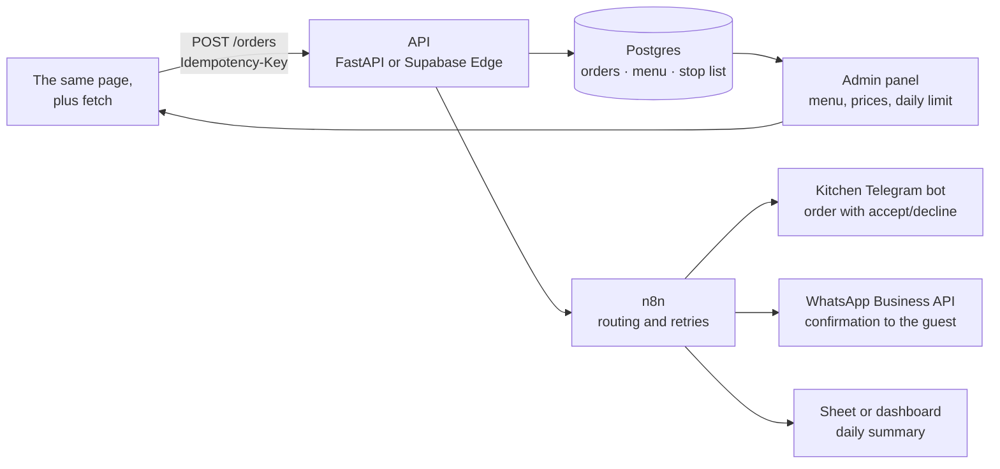

# What comes next

Phase one solved one problem: get an order from the guest to the kitchen without a server. It does that, and the solution has a ceiling. Below is what I would build next, ordered by value to the business rather than by how interesting it is to write.

[← back to the overview](../README.md)

---

## Near term, still without a backend

Three things that fit inside the current architecture and take about a day.

**Self-host the font.** Remove the first paint's dependency on `fonts.googleapis.com`: put the woff2 next to the page, declare `@font-face` in the inline CSS, add the OFL licence file. While in there, split display and body type so journal paragraphs stop being work to read.

**URLs for menu items.** `pushState` when a card opens, `popstate` when it closes. Then a link to a specific roll can be dropped into a chat, the Android back button closes the overlay instead of the page, and a search engine has something to index. Open Graph tags belong in the same pass, so a shared link unfolds into a card with the logo.

**Validation on the map step.** Right now the step can be skipped empty. It should require either coordinates or a non-empty address, keeping an "I cannot drop a pin" escape hatch for when the tiles fail to load.

---

## Phase two: the server

The main hole in the first version is that the order only reaches the kitchen when the guest taps the WhatsApp button. Everything else follows from the same root: no daily limit counter, no stop list, no price validation, and reviews only their author can see.

Step by step:

1. The page posts the order to the API and gets its id back from the server. The WhatsApp button stays, but as a convenience for the guest rather than the only channel.
2. An `Idempotency-Key` header carrying the order id: a double tap on a flaky connection does not create a second order.
3. The API writes the order into Postgres, checks prices against the database instead of trusting the browser, and decrements the daily limit counter inside a transaction.
4. n8n picks up the event and fans it out: an order card into the kitchen Telegram bot with accept and decline buttons, a confirmation to the guest over WhatsApp, a row in the daily summary. Retries with exponential backoff, structured logs at every step.
5. Menu, prices and the stop list move into the database. The owner edits them in an admin panel instead of in HTML.

The stack is picked for what I already work with, not for elegance: FastAPI or Supabase Edge Functions, Postgres, self-hosted n8n in Docker, the Telegram Bot API. All of it fits on one small VPS.

Rough timing for one person: a week for the API and the database, a few more days for the n8n routing and the bot, another week for the admin panel. Payments and acquiring are counted separately, since there is more paperwork there than code.

---

## Phase three: the product

- **Food photography.** The emoji placeholders go away; the markup for images is already there. Shoot, retouch, then AVIF and WebP with `srcset` for screen density.
- **Three languages.** English, Russian, Georgian. The text is half the job: the type pairing has to cover all three alphabets, and Bebas Neue covers neither Cyrillic nor Georgian.
- **Online payment.** Acquiring through Georgian banks (BOG, TBC) or a card provider on top. Only after orders reliably arrive through the API — payment on top of an unreliable channel is a bad idea.
- **Reviews on the server.** Right now they live in their author's browser. Real moderation, plus pulling in reviews from Google Maps, where people leave them anyway.
- **Analytics.** A minimum set of events: card opened, added to cart, checkout step, order submitted. Without those, any conversation about conversion is guesswork.
- **Repeat orders.** For a private kitchen capped at five sets a day the value sits in regulars: order history, one-tap reorder, a reminder before the weekend.

---

## What I will not build

I am not rewriting this in React. One page, four layers, state in a single object. A framework would add a build and dependencies without removing a single existing problem.

No design system either: forty CSS variables are enough here. A separate component package earns its place when there is more than one page and more than one developer.

Own delivery with tracking, not now. Five sets a day, a small city, coordination in WhatsApp. Tracking starts paying off in the tens of orders a day, not before.

---

[← back to the overview](../README.md) · [decisions](decisions.md) · [architecture](architecture.md) · [measurements](performance.md)
