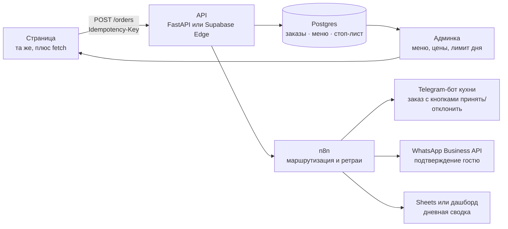

# Что дальше

Первая фаза решала одну задачу: довести заказ от гостя до кухни без сервера. Она это делает, и у решения есть потолок. Ниже то, что я сделал бы дальше, в порядке пользы для бизнеса, а не интересности для разработчика.

[← назад к обзору](../README.md)

---

## Ближайшее, без бэкенда

Три вещи, которые можно закрыть в текущей архитектуре за день.

**Шрифт к себе.** Убрать зависимость первого рендера от `fonts.googleapis.com`: положить woff2 рядом, объявить `@font-face` в инлайновом CSS, добавить файл лицензии OFL. Заодно развести дисплейный и текстовый шрифт, чтобы абзацы в журнале читались без усилия.

**URL у позиций меню.** `pushState` при открытии карточки, `popstate` на закрытие. Тогда ссылку на конкретный ролл можно кинуть в чат, кнопка «назад» на Android будет закрывать оверлей, а не страницу, и поисковику появится что индексировать. Туда же Open Graph, чтобы ссылка в мессенджере раскрывалась карточкой с логотипом.

**Валидация шага с картой.** Сейчас шаг проскакивается пустым. Правильно: требовать либо координаты, либо непустой адрес, оставив кнопку «не могу поставить точку» для случая, когда тайлы не грузятся.

---

## Вторая фаза: сервер

Главная дыра первой версии в том, что заказ уезжает на кухню только когда гость нажал кнопку WhatsApp. Всё остальное — следствия того же: нет счётчика дневного лимита, нет стоп-листа, нет проверки цены, отзывы видит только автор.

Как это работает по шагам:

1. Страница отправляет заказ на API и получает номер от сервера. Кнопка WhatsApp остаётся, но уже как удобство для гостя, а не как единственный канал.
2. Заголовок `Idempotency-Key` с номером заказа: двойной тап по кнопке на плохой связи не создаёт второй заказ.
3. API пишет заказ в Postgres, проверяет цены по базе, а не по тому, что прислал браузер, и уменьшает счётчик дневного лимита в транзакции.
4. n8n забирает событие и разносит: карточка заказа в Telegram-бот кухни с кнопками «принять» и «отклонить», подтверждение гостю в WhatsApp, строка в сводку за день. Ретраи с экспоненциальной задержкой, структурные логи по каждому шагу.
5. Меню, цены и стоп-лист переезжают в базу. Владелец правит их в админке, а не в HTML.

Стек выбран не по красоте, а по тому, что я на нём уже работаю: FastAPI или Supabase Edge Functions, Postgres, n8n на самохостинге в Docker, Telegram Bot API. Всё это разворачивается на одном небольшом VPS.

Ориентир по срокам, если делать одному: неделя на API и базу, ещё несколько дней на маршрутизацию в n8n и бота, неделя на админку. Оплата и эквайринг считаются отдельно — там больше бумаг, чем кода.

---

## Третья фаза: продукт

- **Фотографии блюд.** Заглушки-эмодзи уходят, разметка под картинки уже готова. Съёмка, обработка, AVIF и WebP с `srcset` под плотность экрана.
- **Три языка.** Английский, русский, грузинский. Тексты тут половина работы: шрифтовая пара должна покрывать все три алфавита, а Bebas Neue не покрывает ни кириллицу, ни грузинский.
- **Оплата онлайн.** Эквайринг грузинских банков (BOG, TBC) или карточный провайдер поверх. Только после того, как заказы начнут стабильно приходить через API: оплата поверх ненадёжного канала — плохая идея.
- **Отзывы на сервере.** Сейчас они живут в браузере автора. Настоящая модерация плюс подтягивание отзывов из Google Maps, где их и оставляют чаще всего.
- **Аналитика.** Минимум событий: открытие карточки, добавление в корзину, шаг оформления, отправка заказа. Без этого разговор об конверсии — гадание.
- **Программа повторных заказов.** У приватной кухни с лимитом пять сетов в день ценность в постоянных гостях: история заказов, повтор в один тап, напоминание перед выходными.

---

## Чего делать не буду

Переписывать на React не буду. Одна страница, четыре наложения, состояние в одном объекте. Фреймворк добавит сборку и зависимости, но не уберёт ни одной существующей проблемы.

Дизайн-систему тоже не буду: сорока CSS-переменных здесь хватает. Отдельный пакет компонентов оправдан, когда страниц больше одной и разработчиков тоже.

Своя доставка с трекингом — не сейчас. Пять сетов в день, небольшой город, координация в WhatsApp. Трекинг начинает окупаться на десятках заказов в день, не раньше.

---

[← назад к обзору](../README.md) · [решения](decisions.md) · [архитектура](architecture.md) · [замеры](performance.md)
